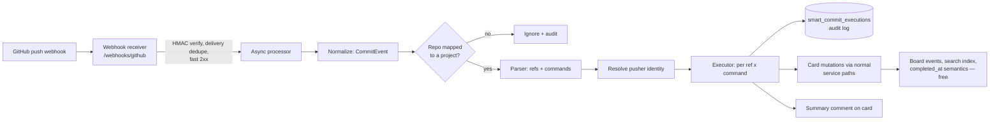

# Smart Commit Integration

## Abstract

This document specifies the Smart Commit Integration for Sunbeam Kanban: a
forge-triggered channel through which commit messages enrich cards with
relationships and metadata — links, comments, labels, assignees, and time
entries — using a Jira-style command grammar (`#fixes KANBAN-034 #comment
... #time 2h`). Commands execute as the forge-authenticated pusher, mapped
to a Kanban identity, with per-command permission enforcement and a
complete audit trail; commit author email is never trusted. The design is
forge-agnostic in its core (a normalized commit event, a parser, an
executor, and an audit log); GitHub is the first ingress, delivered by
extending the existing webhook receiver with push events. The document
also specifies the TimeTrackingService that the `#time` command requires.
Process-changing actions (column or project moves) are an explicit
anti-goal: commits MUST NOT alter a card's workflow position.

## Document Status

This document is in **Planned Implementation** status. It was reviewed
and approved on 2026-07-31 (PR #3). Implementation tickets are filed on
the kanban project board (KANBAN-041 lineage, broken out per the rollout
phases in Section 13) and each ticket conforms to this specification.
Design changes discovered during implementation MUST be reflected back
into this document before the affected ticket ships.

## Table of Contents

- [1. Introduction](#1-introduction)
  - [1.1. Requirements Language](#11-requirements-language)
  - [1.2. Terminology](#12-terminology)
- [2. Architecture Overview](#2-architecture-overview)
- [3. Project Repository Mapping](#3-project-repository-mapping)
- [4. Commit Message Grammar](#4-commit-message-grammar)
- [5. Identity and Authorization](#5-identity-and-authorization)
- [6. Processing Pipeline](#6-processing-pipeline)
- [7. Time Tracking](#7-time-tracking)
- [8. Data Model](#8-data-model)
- [9. Interface Definitions](#9-interface-definitions)
- [10. Operational Behavior](#10-operational-behavior)
- [11. Compatibility](#11-compatibility)
- [12. Security Considerations](#12-security-considerations)
- [13. Deployment Considerations](#13-deployment-considerations)
- [14. References](#14-references)
  - [14.1. Normative References](#141-normative-references)
  - [14.2. Informative References](#142-informative-references)
- [Acknowledgements](#acknowledgements)
- [Author's Address](#authors-address)

---

## 1. Introduction

Developers already narrate their work in commit messages. Forges exploit
this: GitHub autolinks `owner/repo#123` and closes issues on `fixes #123`
landing on the default branch; Jira smart commits execute commands such as
`PROJ-123 #comment …`, `#time 2h`, and `#transition` against issues, as the
mapped committer, with a per-commit processing log. Sunbeam Kanban users
want the same depth of integration for cards — but Kanban's model differs
from both forges in ways this document designs around:

- Kanban has **no workflow states**; cards live in board columns. Column
  moves encode team process, and that process outranks any commit.
- Card refs (`KANBAN-034`, `SDK-012`) are unique per project per tenant
  and greppable by construction — an ideal grammar anchor.
- Commit author identity is self-declared text and MUST NOT be trusted.

Scope: the forge-agnostic core (normalized commit event, grammar, parser,
executor, audit trail), the GitHub ingress, and the TimeTrackingService
required by `#time`. Out of scope: issue/PR state synchronization
(KANBAN-019/020/021, though the ingress endpoint is shared), automatic
card transitions of any kind, and forges other than GitHub.

### 1.1. Requirements Language

The key words "MUST", "MUST NOT", "REQUIRED", "SHALL", "SHALL NOT",
"SHOULD", "SHOULD NOT", "RECOMMENDED", "NOT RECOMMENDED", "MAY", and
"OPTIONAL" in this document are to be interpreted as described in
BCP 14 [RFC2119] [RFC8174] when, and only when, they appear in all
capitals, as shown here.

### 1.2. Terminology

**Smart commit**: A commit whose message contains one or more commands in
the grammar defined in Section 4.

**Pusher**: The forge-authenticated account that delivered the commits to
the forge (GitHub `sender.login` in a push webhook delivery). Distinct
from the commit *author*, which is unverified text.

**Backlink**: An untyped card↔commit link created by a plain ref mention,
requiring no authorization (GitHub's autolink model).

**Typed link**: A card↔commit link carrying a claim (v1: `fixes`),
created by a command and therefore authorized.

**Repo mapping**: The per-project set of forge repositories (≤ 50) whose
events a project accepts and whose bare refs resolve to that project.

**Execution**: One audit-recorded application of one command to one card
from one commit.

## 2. Architecture Overview



The core is forge-agnostic: everything downstream of the normalized
`CommitEvent` (Section 6.1) has no GitHub knowledge. A second forge is an
ingress adapter and nothing more. The GitHub ingress extends the webhook
receiver specified for issue/PR events (KANBAN-019) with `push` deliveries
— one endpoint, one HMAC secret, one dedupe store.

Design decisions locked with the product owner (2026-07-31):

1. Commands express **relationships and metadata only**. They MUST NOT
   move a card between columns or projects, and no command defined in
   this document does so. This is an anti-goal: such transitions break
   processes that outrank commits.
2. Because no command alters process state, commits on **any branch** are
   processed; no default-branch gating (contrast GitHub's issue-closing
   semantics).
3. Commands execute as the **pusher**, never the claimed author
   (Section 5).
4. A push is never rejected because a command failed; every command's
   outcome is recorded individually (Section 6.4).

## 3. Project Repository Mapping

Each project declares the GitHub repositories whose events it accepts,
capped at **50 repositories per project**. The cap is a deliberate
project-management hygiene gate: a project needing more than fifty repos
is structured wrong, and the limit makes that visible instead of silently
accommodating it.

The mapping serves two functions:

- **Acceptance and attribution.** A push delivery for an unmapped
  repository is ignored (recorded at debug level). A delivery for a
  mapped repository is processed under the owning project and tenant.
  A repository MUST map to at most one project per tenant.
- **Bare-ref resolution.** Inside a mapped repository, a bare `#123`
  resolves to card 123 of the mapped project. Full refs (`KANBAN-034`)
  always resolve tenant-wide and are the only form that works
  cross-project.

The mapping is configured on the project (Section 9.2) and stored per
Section 8.1.

## 4. Commit Message Grammar

### 4.1. Lexical rules

```abnf
message     = *( token / text )
token       = command / full-ref / bare-ref
full-ref    = 1*8(ALPHA / DIGIT) "-" 1*DIGIT     ; KANBAN-034
bare-ref    = "#" 1*DIGIT                        ; #123
command     = "#" command-word [argument]
command-word = "fixes" / "comment" / "time" /
               "label" / "unlabel" /
               "assign" / "unassign"
```

A `#` followed by digits is a bare ref; a `#` followed by letters is a
command. Command keywords are case-insensitive and reserved: new keywords
MUST NOT be introduced in a way that makes previously plain text
meaningful. Refs are case-sensitive uppercase, matching card ref
canonical form.

### 4.2. Reference resolution

Every full ref in the message resolves tenant-wide. Every bare ref
resolves against the delivery's mapped project. The set of *referenced
cards* is the union of all resolved refs that exist; unresolvable refs
produce an audit row with status `ref_not_found` and no other effect.

### 4.3. Command semantics

All commands in a message apply to **all referenced cards** in that
message. This "wide" semantics is deliberate and MUST be documented
user-side: one commit can enrich several cards at once.

| Command | Argument | Effect per referenced card |
|---------|----------|----------------------------|
| `#fixes` | — | Typed link `fixes` (Section 8.5) + summary comment |
| (bare mention) | — | Backlink (`ref` link type); no comment |
| `#comment` | rest of line | Comment on the card |
| `#time` | duration + optional text | Time entry (Section 7) |
| `#label` | label name | Attach label from the card project's catalog |
| `#unlabel` | label name | Detach label |
| `#assign` | user reference | Assign (identity ULID, `user:<ulid>`, or email) |
| `#unassign` | user reference | Unassign |

`#fixes` takes no argument of its own; it types the relationship between
the commit and every referenced card. Example:

```
Fix the label panic on global cards

#fixes KANBAN-034 #comment root cause was the NULL project_id decode
#time 1h 30m pairing with the outbox fix
```

### 4.4. Failure semantics

Commands are independent: one failing command MUST NOT affect sibling
commands or the delivery. Nothing about smart-commit processing fails the
push, the webhook delivery, or any non-command behavior. Outcomes are
recorded per execution (Section 6.4) and summarized per Section 6.5.

## 5. Identity and Authorization

### 5.1. Authority is the pusher

GitHub authenticates the pusher: `sender.login` in a signed webhook
delivery is an identity assertion by the forge. Commit author and
committer fields are unverified text and MUST NOT be used for
authorization. Email addresses from commits play no role in identity
resolution.

Pusher logins map to Kanban identities via `github_identities`
(Section 8.2). The mapping MUST be grounded in a verified GitHub login on
the sso-gateway identity (an identity trait established through OAuth),
not in self-declaration — a self-declared login would reintroduce the
spoofing this design exists to prevent. Where the gateway does not yet
expose a verified login, a service-admin-managed mapping is the interim
path (Section 13).

### 5.2. Unmapped pushers

If the pusher has no mapped identity, all commands in the delivery are
skipped with audit status `identity_unmapped`. Backlinks (Section 4.3)
are still recorded — they carry no claim and match GitHub's autolink
behavior.

### 5.3. Per-command permission enforcement

Every command executes as the mapped pusher's identity and is authorized
exactly as the equivalent user action: `#comment`, `#label`, `#assign`,
and `#time` require `edit` on the card's board (mirroring AddComment,
BulkUpdateCardLabels, AssignCard, and LogTime); `#fixes` typed links
require `edit` on the card's board. A failed check produces an audit row
with status `permission_denied` and no mutation. Backlinks require no
permission.

### 5.4. Attribution

All mutations record the executing subject. Comments authored by smart
commits carry the pusher's identity with provenance text (repository,
SHA, branch), and executions record both the pusher and the claimed
commit author for auditability ("executed as tony@ via push of commit
authored by sienna@…" when they differ).

## 6. Processing Pipeline

### 6.1. Normalized commit event

```json
{
  "repo": "sunbeamdotpt/kanban",
  "branch": "mainline",
  "pusher_login": "sienna",
  "commits": [
    {
      "sha": "6ab6901f66…",
      "message": "…",
      "author_text": "Sienna <sienna@sunbeam.pt>",
      "url": "https://github.com/sunbeamdotpt/kanban/commit/6ab6901f66…"
    }
  ]
}
```

This is the only structure the core consumes. The GitHub adapter builds
it from `push` deliveries; other forges build it from theirs.

### 6.2. Ingress (GitHub)

The webhook receiver (KANBAN-019's `/webhooks/github`) additionally
accepts `push` events. HMAC-SHA256 signature verification, delivery-id
deduplication, and a fast 2xx with asynchronous processing (GitHub's 10 s
limit) apply exactly as specified there. Distinct commits are compared by
SHA: deliveries that re-push known SHAs (force-push, branch fan-out)
reuse prior parsing but re-evaluate per-branch acceptance.

### 6.3. Parser

The parser is a pure function `message → {refs, commands}`. It MUST be
total (every input parses, possibly to zero commands) and MUST NOT
execute side effects. It is independently unit-tested against the grammar
in Section 4.

### 6.4. Executor and audit trail

For each referenced card × command, the executor performs the mutation
through the same internal paths the public RPCs use, so board events,
search indexing, idempotency, and `completed_at` semantics come free.
Each execution writes one `smart_commit_executions` row (Section 8.4)
with its outcome: `ok`, `ref_not_found`, `identity_unmapped`,
`permission_denied`, or `error`. Idempotency is structural: the tuple
`(repo, sha, ref, command)` is unique, making webhook redelivery and
force-push re-processing safe.

### 6.5. Summary comment

After processing a delivery, the executor posts at most one comment per
referenced card summarizing what that commit did to that card
("Commit `6ab6901` on `mainline` (pushed by sienna): linked as fixes;
comment added; 1h 30m logged."). Only successful executions are
summarized; failures live in the audit log (and a future UI surface), not
in card chatter. Cards referenced by bare mention receive no comment.

## 7. Time Tracking

`#time` requires a first-class time-tracking feature, specified here as
the **TimeTrackingService**.

### 7.1. Duration grammar

```abnf
duration = 1*( component *WSP )
component = 1*DIGIT ("w" / "d" / "h" / "m")
```

Working-time convention, Jira-compatible: `1w = 5d`, `1d = 8h`,
`1h = 60m`. `1w 2d 3h 30m` is 44.5 hours. Bare numbers are minutes.
Durations MUST be positive; zero and unparsable values produce an audit
row with status `error` and no entry.

### 7.2. Model

A time entry records: card, subject (who worked), duration, optional
description, source (`smart_commit` | `manual` | `cli`), the originating
commit SHA when applicable, and the log timestamp. Entries are immutable
except deletion by their author or a board editor. A card's total is
computed per request (grouped query, like milestone stats) — no
denormalized counters.

### 7.3. Interface

`LogTime`, `ListTimeEntries`, and `DeleteTimeEntry` (Section 9.3),
authorized as `edit` / `view` / `edit` on the card's board respectively.
The CLI gains `card log-time` as a separate workstream; the smart-commit
`#time` producer is just another caller of `LogTime`.

## 8. Data Model

All tables are tenant-scoped and created by new one-way migrations
(numbered after the current head, 0035).

### 8.1. project_github_repos

`(tenant_id, project_id, repo, created_at)` — `UNIQUE(tenant_id, repo)`
enforces one project per repo per tenant; a `CHECK` or service-level cap
enforces ≤ 50 rows per project (service-level, to return a proper
`invalid_argument` rather than a constraint violation).

### 8.2. github_identities

`(tenant_id, github_login, identity_id, created_at)` —
`UNIQUE(tenant_id, github_login)`. Populated from the gateway identity's
verified GitHub login trait where available; service-admin managed
otherwise (Section 5.1).

### 8.3. time_entries

`(id, tenant_id, card_id, subject, duration_seconds, description, source,
commit_sha NULL, logged_at)` — indexed by `(tenant_id, card_id)`.

### 8.4. smart_commit_executions

`(id, tenant_id, delivery_id, repo, branch, sha, pusher_login,
author_text, mapped_subject NULL, card_ref, command, argument, status,
error, created_at)` — `UNIQUE(repo, sha, card_ref, command)`. This is the
processing log: every attempted execution, successful or not.

### 8.5. card_commit_links

`(tenant_id, card_id, repo, sha, url, link_type, created_at)` —
`link_type ∈ {ref, fixes}`; `UNIQUE(card_id, repo, sha, link_type)`.
Surfaced on card reads (Section 9.4) so the "deeper integration" is
visible without reading comments.

## 9. Interface Definitions

All proto changes are additive; the package is published to
`buf.build/sunbeamdotpt/kanban` after `buf breaking` confirms
compatibility. New RPCs are added to the permission dispatch matrix in
the same change (`permission-coverage` must stay green).

### 9.1. Grammar and events

No wire format: the grammar (Section 4) is a parser contract, versioned
by this document. No new board event types: smart-commit mutations reuse
`CardUpdated`/comment events from the underlying mutations; the summary
comment is an ordinary comment.

### 9.2. Project configuration

`Project` gains `repeated string github_repos` (next free tag);
`UpdateProjectRequest` gains the same field with field-mask semantics
(mask naming the field applies it wholesale). The service rejects updates
exceeding 50 entries with `invalid_argument`, and rejects mapping a repo
already mapped to another project with `already_exists`.

### 9.3. TimeTrackingService

```proto
service TimeTrackingService {
  rpc LogTime(LogTimeRequest) returns (LogTimeResponse);
  rpc ListTimeEntries(ListTimeEntriesRequest) returns (ListTimeEntriesResponse);
  rpc DeleteTimeEntry(DeleteTimeEntryRequest) returns (DeleteTimeEntryResponse);
}
```

`LogTime` takes `card_id`, `duration_seconds`, optional `description`,
and an idempotency key; `source` is server-assigned (`manual` unless the
caller is the smart-commit executor).

### 9.4. Card surface

`Card` gains `repeated CommitLink commit_links` and
`uint64 total_time_seconds` (next free tags), hydrated on the same read
paths as assignees and checklist.

## 10. Operational Behavior

- **Ordering.** Executions for one delivery run sequentially; deliveries
  are independent. Card mutations within one delivery SHOULD be wrapped
  in per-card transactions, never one delivery-wide transaction.
- **Retries.** Delivery processing failures retry with backoff inside the
  async worker; terminal failures land in the audit log with
  `status = error`. The reconciliation worker (KANBAN-020) is the
  missed-webhook fallback for issue/PR state; push redelivery is
  GitHub's responsibility, made safe by execution idempotency.
- **Observability.** Prometheus counters per execution status; a WARN
  log per non-`ok` execution with delivery id and SHA; the audit table is
  the long-term debugging surface.
- **Interaction with auto-status (KANBAN-021).** None in this version:
  smart commits never change workflow state, and issue/PR auto-status
  remains a separate, still-open product decision.

## 11. Compatibility

Every change is additive: new tables, new proto fields and services, new
matrix entries, new webhook event type. Unmapped repositories experience
no behavior change. No existing RPC semantics change. Migrations are
one-way and boot-applied per project policy. The CLI and SDK pick up the
new proto on their normal regeneration cadence; no client breaks.

## 12. Security Considerations

**Threat model.** The asset is card integrity: who may write to a card,
and with what provenance. Trust boundaries: the forge→receiver boundary
(HMAC), and the human→forge boundary (pusher authentication, delegated to
GitHub).

- **Author spoofing** is the canonical smart-commit attack
  (`git commit --author="ceo@corp"`). It is defeated by construction:
  author text is never used for identity; only the forge-authenticated
  pusher authorizes (Section 5.1), and the identity mapping MUST be
  verified, not self-declared.
- **Webhook forgery** is defeated by HMAC-SHA256 on the shared secret,
  per the receiver specification.
- **Spam from unmapped repos** is defeated by the acceptance gate
  (Section 3): unmapped repos are ignored, and a repo maps to exactly one
  project.
- **Privilege escalation via commands** is defeated by per-command
  permission enforcement as the mapped identity (Section 5.3); a pusher
  can do nothing by commit that they could not do in the UI.
- **Audit.** Every attempted execution is recorded with pusher, claimed
  author, and outcome; this log is the forensic trail for disputed
  mutations.
- **Explicit non-goals.** Process transitions via commits are prohibited
  by design (Section 2). Signed-commit (GPG/SSH) verification as a
  per-repo tightening tier is acknowledged as future work, not specified
  here.

## 13. Deployment Considerations

- **Migrations.** New tables apply at boot (one-way, next free numbers
  after 0035). No data backfill is required.
- **Configuration.** The receiver reuses the GitHub webhook HMAC secret
  (`KANBAN_GITHUB_WEBHOOK_SECRET`, sbbb-owned) — no new secret classes.
  Ingress MUST pass the `X-Hub-Signature-256` and `X-GitHub-*` headers
  intact.
- **Gateway dependency.** Verified GitHub logins on sso-gateway
  identities are the preferred source for `github_identities`; until the
  gateway exposes them, the mapping is service-admin managed. This
  dependency SHOULD be resolved before wide rollout.
- **Rollout phases.** Phase 1: repo mapping, push ingress, parser, audit
  log, backlinks, `#comment`. Phase 2: `#fixes` typed links,
  `#label`/`#unlabel`, `#assign`/`#unassign`. Phase 3:
  TimeTrackingService and `#time`. Each phase is independently shippable
  and additive.
- **Kubernetes.** No new workloads; the processor runs in the kanban
  binary like the outbox dispatcher. Resource impact is bounded by push
  volume × referenced cards.

## 14. References

### 14.1. Normative References

[RFC2119]  Bradner, S., "Key words for use in RFCs to Indicate
           Requirement Levels", BCP 14, RFC 2119, March 1997,
           <https://www.rfc-editor.org/info/rfc2119>.

[RFC8174]  Leiba, B., "Ambiguity of Uppercase vs Lowercase in
           RFC 2119 Key Words", BCP 14, RFC 8174, May 2017,
           <https://www.rfc-editor.org/info/rfc8174>.

### 14.2. Informative References

[GH-AUTOLINK]  GitHub Docs, "Autolinked references and URLs" and
           "Closing issues using keywords",
           <https://docs.github.com/en/get-started/writing-on-github>.

[JIRA-SMART]  Atlassian Documentation, "Process issues with smart
           commits",
           <https://support.atlassian.com/bitbucket-cloud/docs/process-issues-with-smart-commits/>.

[KANBAN-019]  Sunbeam Kanban board, "GitHub webhook receiver:
           auto-sync linked issue/PR state" (webhook receiver
           specification this document extends).

[KANBAN-021]  Sunbeam Kanban board, "Auto-status: propagate GitHub
           issue/PR state onto linked cards" (deferred product
           decision; see Section 10).

## Acknowledgements

Design decisions recorded here were made by Sienna in session on
2026-07-31 (command grammar without transitions, the 50-repo hygiene cap,
pusher-identity authorization, per-command audit semantics, and receiver
placement). Document drafted by the kanban maintainer agent.

## Author's Address

Name: Sienna Meridian Satterwhite
Organization: Sunbeam Studios
Department: Engineering
Role: Principal Engineer
Email: sienna@sunbeam.pt
